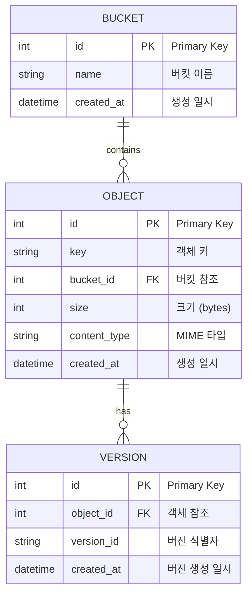

## ERD

```mermaid
erDiagram
    BUCKET {
        int id PK "Primary Key"
        string name "버킷 이름"
        datetime created_at "생성 일시"
    }
    OBJECT {
        int id PK "Primary Key"
        string key "객체 키"
        int bucket_id FK "버킷 참조"
        int size "크기 (bytes)"
        string content_type "MIME 타입"
        datetime created_at "생성 일시"
    }
    VERSION {
        int id PK "Primary Key"
        int object_id FK "객체 참조"
        string version_id "버전 식별자"
        datetime created_at "버전 생성 일시"
    }

    BUCKET ||--o{ OBJECT : contains
    OBJECT ||--o{ VERSION : has
```
