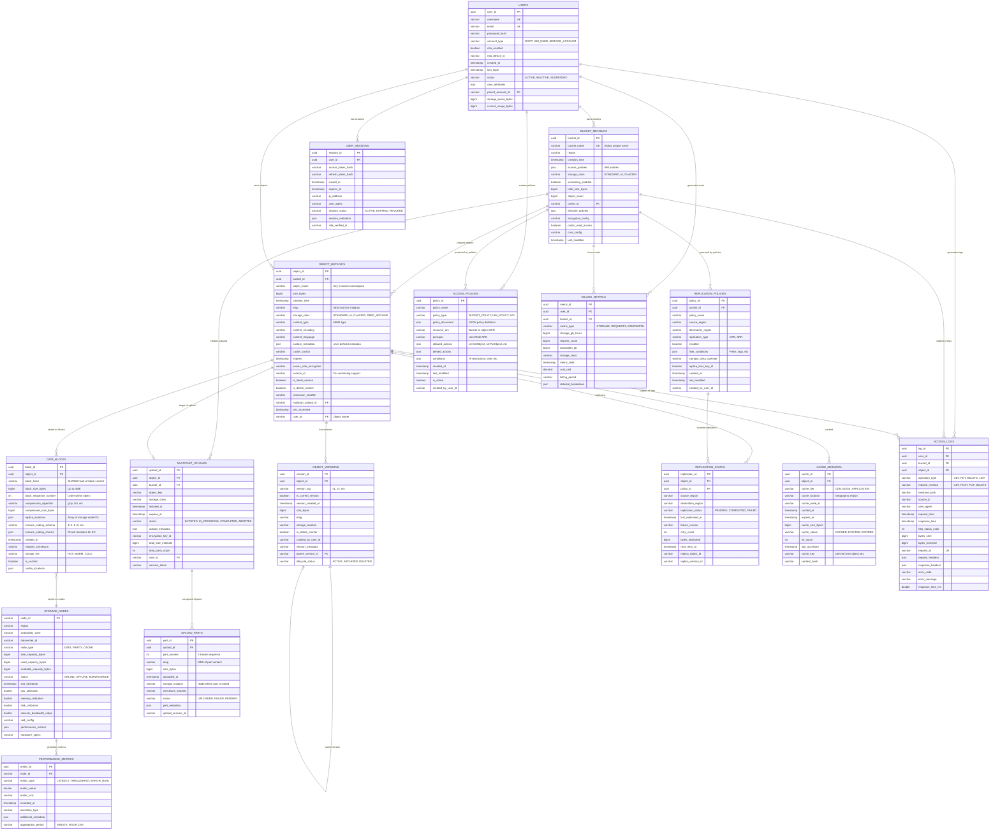

## ERD

```mermaid
erDiagram
%% Core Metadata Tables (Alex Xu's Original)
    BUCKET_METADATA {
        uuid bucket_id PK
        varchar bucket_name UK "Global unique name"
        varchar region
        timestamp creation_time
        json access_policies "IAM policies"
        varchar storage_class "STANDARD, IA, GLACIER"
        boolean versioning_enabled
        bigint total_size_bytes
        bigint object_count
        varchar owner_id FK
        json lifecycle_policies
        varchar encryption_config
        boolean public_read_access
        varchar cors_config
        timestamp last_modified
    }

    OBJECT_METADATA {
        uuid object_id PK
        uuid bucket_id FK
        varchar object_name "Key in bucket namespace"
        bigint size_bytes
        timestamp creation_time
        varchar etag "MD5 hash for integrity"
        varchar storage_class "STANDARD, IA, GLACIER, DEEP_ARCHIVE"
        varchar content_type "MIME type"
        varchar content_encoding
        varchar content_language
        json custom_metadata "User-defined metadata"
        varchar cache_control
        timestamp expires
        varchar server_side_encryption
        varchar version_id "For versioning support"
        boolean is_latest_version
        boolean is_delete_marker
        varchar checksum_sha256
        varchar multipart_upload_id FK
        timestamp last_accessed
        varchar user_id FK "Object owner"
    }

%% Data Storage Layer (4MB Block Architecture)
    DATA_BLOCKS {
        uuid block_id PK
        uuid object_id FK
        varchar block_hash "SHA256 hash of block content"
        bigint block_size_bytes "Up to 4MB"
        int block_sequence_number "Order within object"
        varchar compression_algorithm "gzip, lz4, etc"
        bigint compressed_size_bytes
        json replica_locations "Array of storage node IDs"
        varchar erasure_coding_schema "4+2, 6+3, etc"
        json erasure_coding_chunks "Chunk locations for EC"
        timestamp created_at
        varchar integrity_checksum
        varchar storage_tier "HOT, WARM, COLD"
        boolean is_cached
        json cache_locations
    }

    STORAGE_NODES {
        varchar node_id PK
        varchar region
        varchar availability_zone
        varchar datacenter_id
        varchar node_type "DATA, PARITY, CACHE"
        bigint total_capacity_bytes
        bigint used_capacity_bytes
        bigint available_capacity_bytes
        varchar status "ONLINE, OFFLINE, MAINTENANCE"
        timestamp last_heartbeat
        double cpu_utilization
        double memory_utilization
        double disk_utilization
        double network_bandwidth_mbps
        varchar raid_config
        json performance_metrics
        varchar hardware_specs
    }

%% Multipart Upload Support
    MULTIPART_UPLOADS {
        uuid upload_id PK
        uuid object_id FK
        uuid bucket_id FK
        varchar object_key
        varchar storage_class
        timestamp initiated_at
        timestamp expires_at
        varchar status "INITIATED, IN_PROGRESS, COMPLETED, ABORTED"
        json upload_metadata
        varchar encryption_key_id
        bigint total_size_estimate
        int total_parts_count
        varchar user_id FK
        varchar session_token
    }

    UPLOAD_PARTS {
        uuid part_id PK
        uuid upload_id FK
        int part_number "1-based sequence"
        varchar etag "MD5 of part content"
        bigint size_bytes
        timestamp uploaded_at
        varchar storage_location "Node where part is stored"
        varchar checksum_sha256
        varchar status "UPLOADED, FAILED, PENDING"
        json part_metadata
        varchar upload_session_id
    }

%% Versioning and Lifecycle
    OBJECT_VERSIONS {
        uuid version_id PK
        uuid object_id FK
        varchar version_tag "v1, v2, etc"
        boolean is_current_version
        timestamp version_created_at
        bigint size_bytes
        varchar etag
        varchar storage_location
        boolean is_delete_marker
        varchar created_by_user_id
        varchar version_metadata
        varchar parent_version_id FK
        varchar lifecycle_status "ACTIVE, ARCHIVED, DELETED"
    }

%% Replication and Disaster Recovery
    REPLICATION_POLICIES {
        uuid policy_id PK
        uuid bucket_id FK
        varchar policy_name
        varchar source_region
        varchar destination_region
        varchar replication_type "CRR, SRR"
        boolean enabled
        json filter_conditions "Prefix, tags, etc"
        varchar storage_class_override
        boolean replica_kms_key_id
        timestamp created_at
        timestamp last_modified
        varchar created_by_user_id
    }

    REPLICATION_STATUS {
        uuid replication_id PK
        uuid object_id FK
        uuid policy_id FK
        varchar source_region
        varchar destination_region
        varchar replication_status "PENDING, COMPLETED, FAILED"
        timestamp last_replicated_at
        varchar failure_reason
        int retry_count
        bigint bytes_replicated
        timestamp next_retry_at
        varchar replica_object_id
        varchar replica_version_id
    }

%% IAM and Security
    USERS {
        uuid user_id PK
        varchar username UK
        varchar email UK
        varchar password_hash
        varchar account_type "ROOT, IAM_USER, SERVICE_ACCOUNT"
        boolean mfa_enabled
        varchar mfa_device_id
        timestamp created_at
        timestamp last_login
        varchar status "ACTIVE, INACTIVE, SUSPENDED"
        json user_attributes
        varchar parent_account_id FK
        bigint storage_quota_bytes
        bigint current_usage_bytes
    }

    ACCESS_POLICIES {
        uuid policy_id PK
        varchar policy_name
        varchar policy_type "BUCKET_POLICY, IAM_POLICY, ACL"
        json policy_document "JSON policy definition"
        varchar resource_arn "Bucket or object ARN"
        varchar principal "User/Role ARN"
        json allowed_actions "s3:GetObject, s3:PutObject, etc"
        json denied_actions
        json conditions "IP restrictions, time, etc"
        timestamp created_at
        timestamp last_modified
        boolean is_active
        varchar created_by_user_id
    }

    USER_SESSIONS {
        uuid session_id PK
        uuid user_id FK
        varchar access_token_hash
        varchar refresh_token_hash
        timestamp issued_at
        timestamp expires_at
        varchar ip_address
        varchar user_agent
        varchar session_status "ACTIVE, EXPIRED, REVOKED"
        json session_metadata
        varchar mfa_verified_at
    }

%% Caching Layer
    CACHE_METADATA {
        uuid cache_id PK
        uuid object_id FK
        varchar cache_tier "CDN, EDGE, APPLICATION"
        varchar cache_location "Geographic region"
        varchar cache_node_id
        timestamp cached_at
        timestamp expires_at
        bigint cache_size_bytes
        varchar cache_status "CACHED, EVICTED, EXPIRED"
        int hit_count
        timestamp last_accessed
        varchar cache_key "Derived from object key"
        varchar content_hash
    }

%% Monitoring and Analytics
    ACCESS_LOGS {
        uuid log_id PK
        uuid user_id FK
        uuid bucket_id FK
        uuid object_id FK
        varchar operation_type "GET, PUT, DELETE, LIST"
        varchar request_method "GET, POST, PUT, DELETE"
        varchar resource_path
        varchar source_ip
        varchar user_agent
        timestamp request_time
        timestamp response_time
        int http_status_code
        bigint bytes_sent
        bigint bytes_received
        varchar request_id UK
        json request_headers
        json response_headers
        varchar error_code
        varchar error_message
        double response_time_ms
    }

    BILLING_METRICS {
        uuid metric_id PK
        uuid user_id FK
        uuid bucket_id FK
        varchar metric_type "STORAGE, REQUESTS, BANDWIDTH"
        bigint storage_gb_hours
        bigint request_count
        bigint bandwidth_gb
        varchar storage_class
        timestamp metric_date
        decimal cost_usd
        varchar billing_period
        json detailed_breakdown
    }

    PERFORMANCE_METRICS {
        uuid metric_id PK
        varchar node_id FK
        varchar metric_type "LATENCY, THROUGHPUT, ERROR_RATE"
        double metric_value
        varchar metric_unit
        timestamp recorded_at
        varchar operation_type
        json additional_metadata
        varchar aggregation_period "MINUTE, HOUR, DAY"
    }

%% Relationships - Core Architecture
    BUCKET_METADATA ||--o{ OBJECT_METADATA : "contains objects"
    OBJECT_METADATA ||--o{ DATA_BLOCKS : "stored as blocks"
    DATA_BLOCKS }o--|| STORAGE_NODES : "stored on nodes"

%% Relationships - Multipart Uploads
    BUCKET_METADATA ||--o{ MULTIPART_UPLOADS : "initiates uploads"
    OBJECT_METADATA ||--o| MULTIPART_UPLOADS : "target of upload"
    MULTIPART_UPLOADS ||--o{ UPLOAD_PARTS : "composed of parts"

%% Relationships - Versioning
    OBJECT_METADATA ||--o{ OBJECT_VERSIONS : "has versions"
    OBJECT_VERSIONS ||--o| OBJECT_VERSIONS : "parent version"

%% Relationships - Replication
    BUCKET_METADATA ||--o{ REPLICATION_POLICIES : "governed by policies"
    OBJECT_METADATA ||--o{ REPLICATION_STATUS : "replicated"
    REPLICATION_POLICIES ||--o{ REPLICATION_STATUS : "controls replication"

%% Relationships - IAM & Security
    USERS ||--o{ BUCKET_METADATA : "owns buckets"
    USERS ||--o{ OBJECT_METADATA : "owns objects"
    USERS ||--o{ USER_SESSIONS : "has sessions"
    USERS ||--o{ ACCESS_POLICIES : "creates policies"
    BUCKET_METADATA ||--o{ ACCESS_POLICIES : "protected by policies"

%% Relationships - Caching
    OBJECT_METADATA ||--o{ CACHE_METADATA : "cached"

%% Relationships - Monitoring
    USERS ||--o{ ACCESS_LOGS : "generates logs"
    BUCKET_METADATA ||--o{ ACCESS_LOGS : "subject of logs"
    OBJECT_METADATA ||--o{ ACCESS_LOGS : "subject of logs"
    USERS ||--o{ BILLING_METRICS : "generates costs"
    BUCKET_METADATA ||--o{ BILLING_METRICS : "incurs costs"
    STORAGE_NODES ||--o{ PERFORMANCE_METRICS : "generates metrics"
```
