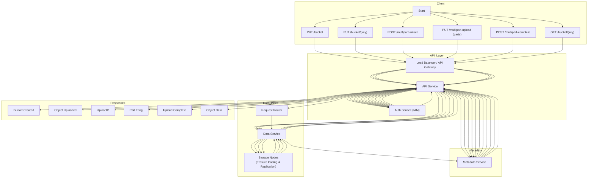

## Detailed S3-like Object Storage Flowchart

```mermaid
flowchart TD
    subgraph Client
        A["Start"]
        B["PUT /bucket"]
        C["PUT /bucket/{key}"]
        D["POST /multipart-initiate"]
        E["PUT /multipart-upload (parts)"]
        F["POST /multipart-complete"]
        G["GET /bucket/{key}"]
    end

    subgraph API_Layer
        LB["Load Balancer / API Gateway"]
        API["API Service"]
        IAM["Auth Service (IAM)"]
    end

    subgraph Metadata
        Meta["Metadata Service"]
    end

    subgraph Data_Plane
        Router["Request Router"]
        DataStore["Data Service"]
        Storage["Storage Nodes\n(Erasure Coding & Replication)"]
    end

    subgraph Responses
        R1["Bucket Created"]
        R2["Object Uploaded"]
        R3["UploadID"]
        R4["Part ETag"]
        R5["Upload Complete"]
        R6["Object Data"]
    end

    A --> B
    B --> LB --> API --> IAM --> API --> Meta --> API --> R1

    A --> C
    C --> LB --> API --> IAM --> API --> DataStore --> Storage --> DataStore --> Meta --> API --> R2

    A --> D
    D --> LB --> API --> IAM --> API --> Meta --> API --> R3

    A --> E
    E --> LB --> API --> IAM --> API --> DataStore --> Storage --> DataStore --> API --> Meta --> API --> R4

    A --> F
    F --> LB --> API --> IAM --> API --> DataStore --> Storage --> DataStore --> API --> Meta --> API --> R5

    A --> G
    G --> LB --> API --> IAM --> API --> Meta --> API --> Router --> DataStore --> Storage --> DataStore --> API --> R6
```
